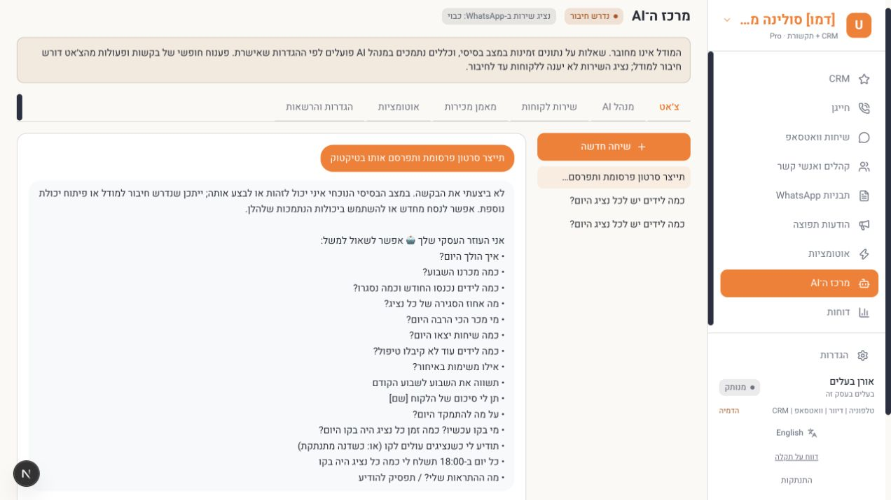
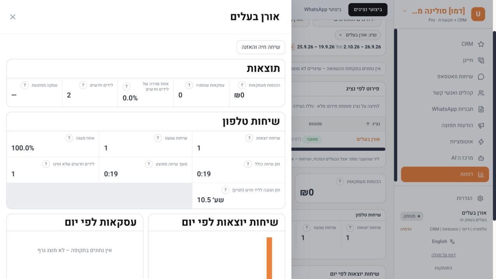

# Functional controls audit — 2 October 2026

## Scope and evidence

This is a broad functional audit, not certification that every possible button, role, configuration and external provider works. Browser checks used an isolated local PostgreSQL database and demo business, with simulated telephony, WhatsApp, email and SMS. No customer was messaged or called. Reloads and server/database results were used to distinguish durable actions from cosmetic UI changes.

## Confirmed bugs corrected

1. Contact CSV export ignored active filters and saved audiences. It now intersects the selected static/dynamic audience, contact filters and existing visibility scope. Missing/foreign audiences fail closed.
2. Creating a dial list from the filtered contacts ignored the saved audience and several filters. A one-contact audience created a 14-contact list before the fix; the same browser flow produced one contact after it.
3. Automation dry-run omitted the required `isActive` field and returned HTTP 400. It now submits a disabled preview rule and shows persistent, input-specific errors. Browser preview passed after the fix; the saved rule also executed after a simulated inbound message.
4. The basic AI assistant gave vague help for unsupported requests. It now explicitly says the request was not performed and distinguishes the possibility of a missing model connection or capability. Browser verification used an unsupported request to generate and publish a TikTok video.
5. The dialer displayed raw `{{agent}}` / `{{business}}` placeholders in the script during a simulated call. Known agent/business/contact/phone fields now render as plain text. Unknown fields remain visible. Unit tests cover literal substitution and missing values; the corrected script was not rechecked in a second browser call.
6. WhatsApp broadcast preflight treated UTILITY templates as exempt from consent while the sender required it. Preflight now matches the sending policy and the worker respects the broadcast sending window for UTILITY templates too. Regression checks cover one eligible / one missing-consent recipient and no dispatch outside the selected window.

## Browser flows exercised

| Area | Action and observed outcome |
| --- | --- |
| Login | Demo owner authenticated and reached CRM. |
| Leads | Created a lead, changed email/product/campaign, added a note and scheduled/edited follow-up. Reload retained the values and the next-day 12:30 follow-up. |
| Contacts/tasks | Created a task, completed it, and verified its completed timeline state and reduced open-task count after reload. |
| Deals | Created a proposal for 1,490, changed it to negotiation for 1,790 with a closing date and note; reopened values matched. |
| Audiences | Saved a dynamic source-based audience; filtered contacts showed exactly one member. |
| Filtered actions | Reproduced dial-list over-selection, retested one-member result after correction, downloaded CSV and verified header plus one selected record. |
| Automation rules | Created inactive rule, previewed, saved, enabled and triggered it using simulated inbound WhatsApp; expected internal note appeared. |
| Inbox | Inbound simulated message appeared, outbound mock reply persisted, assignment and treated status persisted after reload. Freeform sending outside the conversation window was disabled. |
| AI | Basic data query returned a result. Unsupported request explicitly reported non-execution after correction. No live model was connected in QA. |
| Dialer | Started personal queue, made one simulated call, paused, muted/unmuted, hung up, recorded outcome and note, ended session. History and agent report showed one answered, documented call lasting 19 seconds. No real audio verified. |
| Campaign wizard | Created/autosaved WhatsApp draft, selected audience and template, mapped variable, previewed personalized message and submitted to mock processing. Worker skipped missing-consent recipient; the misleading preflight was corrected and regression tested. This particular UI campaign was not a successful delivery. |
| Email/SMS settings | Connection-check and test-send buttons updated check/send timestamps with explicit mock-provider labels. No actual delivery verified. |
| Templates | Search filtered rows; template selection changed preview; creation form, message text and quick-reply button updated preview. No template was submitted to Meta. |
| Agent reports | Separate telephony and WhatsApp navigation present; filtering to the demo owner and opening details matched the simulated call and 19-second duration. |
| Journeys | Created a named draft with a one-hour wait, ran simulation and observed the expected wait result; saved and reloaded the draft with its name and step intact. Kept inactive. |

Other settings, billing, CRM configuration, marketing reports, Meta reporting, carts and integrations received page/navigation inspection only in this pass. These visits are not recorded as end-to-end feature passes.

## Automated verification

- Full integration suite: **996 passed in 90 files** (262.55 seconds).
- Full unit suite: **219 passed in 33 files**.
- Targeted campaign suite after adding the window assertion: **9 passed**.
- Production build: passed with Node 22. Initial restricted-environment build could not open its local worker port; rerun outside that restriction passed.
- TypeScript check: passed after the final source and test changes.
- ESLint: **0 errors, 173 warnings**; warnings remain, so this is not a clean-warning claim.
- Added regression coverage for filtered contact actions, automation-preview payload/error state, unsupported AI requests, call-script substitution and broadcast eligibility/window behavior.

## Remaining limits and known product gaps

- Live WhatsApp delivery/status callbacks, Telnyx audio and real email/SMS delivery need configured providers and a user-controlled test destination. A test number was requested but has not been provided.
- Meta app approval and real template submission were not verified by these local tests.
- Source inspection confirms that inbound IVR/queues/voicemail and the Zadarma purchase integration are explicitly unimplemented. They are not represented as working features by this report.
- No claim of exhaustive coverage of every role/button combination, live provider behavior, zero defects or government security certification.
- The earlier security audit's open MFA/SSO, email-ownership verification and production backup-restore verification items remain outside these functional fixes.

## Screenshots

